La cuenta ya la tenía creada ya que también se usa en otros módulos del ciclo.

1. Para crear un nuevo repositorio desplegamos el "+" junto a la foto de perfil y seleccionamos "New repository":

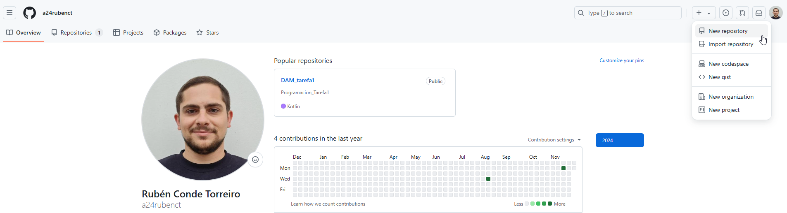

2. En la siguiente pantalla ponemos un nombre al repositorio, una descripción, marcamos "Add a README file" y pinchamos en "Create repository":

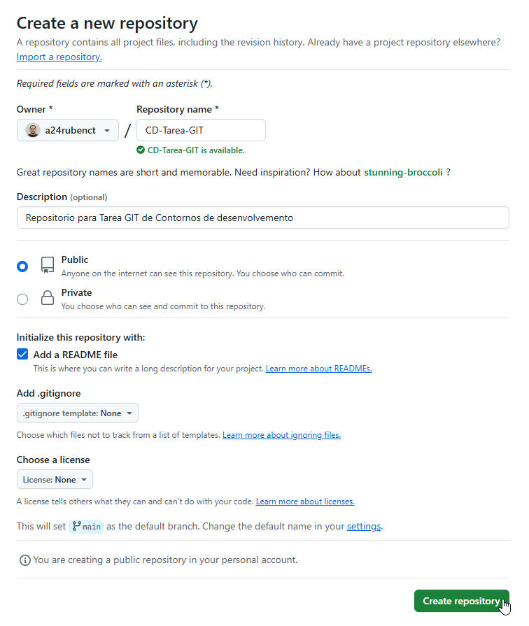

3. Para crear la carpeta "images" en la que se incluirán las capturas de pantalla pinchamos en el "Add file" y seleccionamos "Create new file":

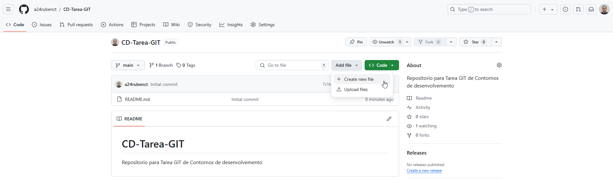

4. Para crear una carpeta simplemente ponemos el nombre seguido de "/" y se crea:

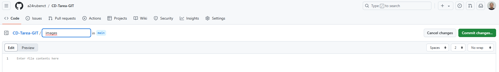
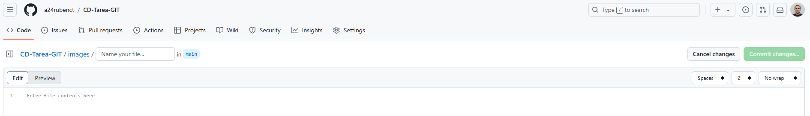

5. Para poder guardar los cambios creamos un archivo que se llamará "vacio" y clicamos en "Commit changes...":

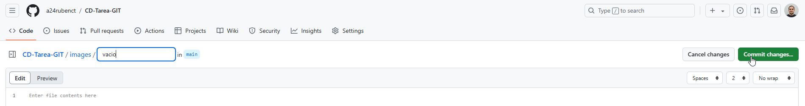

6. Nos salta una ventana en la que pinchamos "Commit changes":

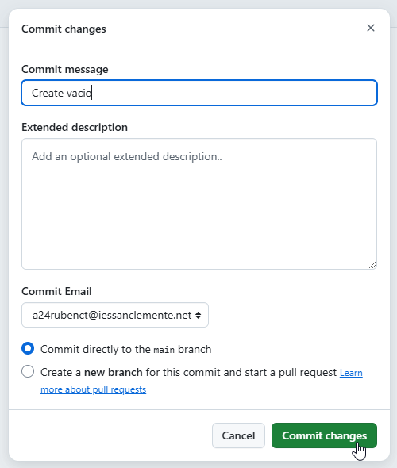

7. En este momento ya tenemos la carpeta "images" creada en la raiz de nuestro repositorio:

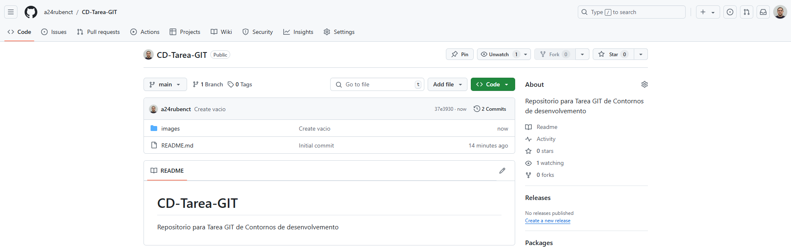

8. Para subir las imagenes entramos en la carpeta "images", seleccionamos "Add file" y después "Upload file":

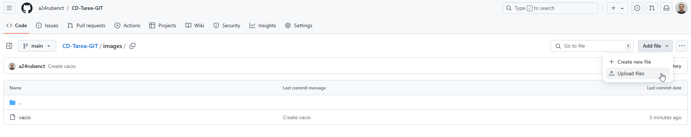

9. Pinchamos en "Choose your files", seleccionamos los archivos a subir y pinchamos en "Commit changes":

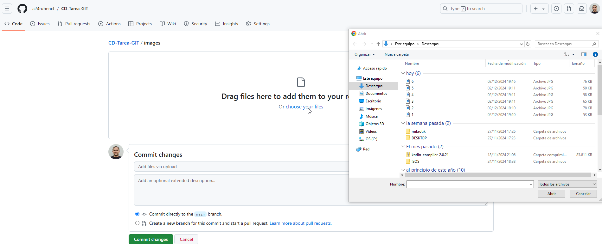

10. Eliminamos el archivo "vacio" abriéndolo y pinchando sobre los puntos suspensivos (...) y "Delete file":

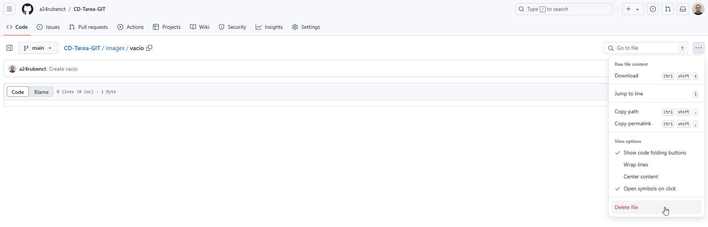

11. Para editar el archivo "README" lo abrimos y pinchamos en lápiz "Edit this file":

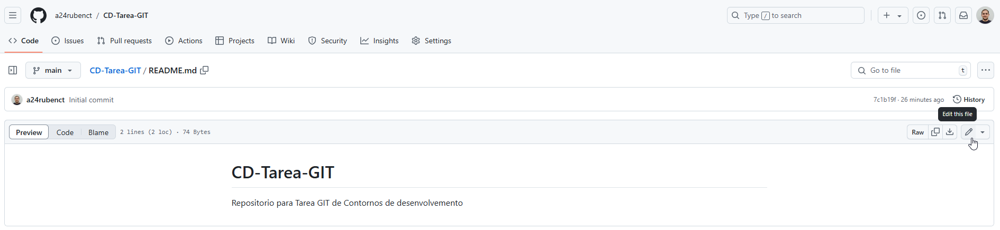

12. Redactamos el archivo con los pasos a seguir para la elaboración del repositorio y pinchamos "Commit changes":

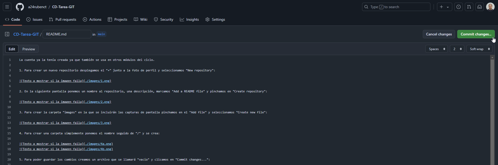
